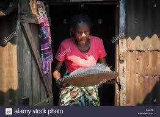

# **Sifting rice**

**How often**: We do it twice a week.
## Tools:

- Sahafa
- Rice
- Baskets
- Sac

## Process

1. Take the sahafa.
1. Add the rice on the sahafa.
1. Sift it to take out the rubbish.
1. Pick up the harsh if there is Then throw them out.
1. Sift it again to finish.
1. Pour the cleaned rice in a basket or a sac.
1. Repeate the process untill it's done.

## Who should do that?

Everyone who doesn't have anything to do should participate.

## Who to call for help?

We need to call Mama Onja, she knows how to do it.

NB: *For more explanation, please visit this link:[cleaning-rice](http://www.google.com/search?q=cleaning+rice+in+madagascar)

   

   